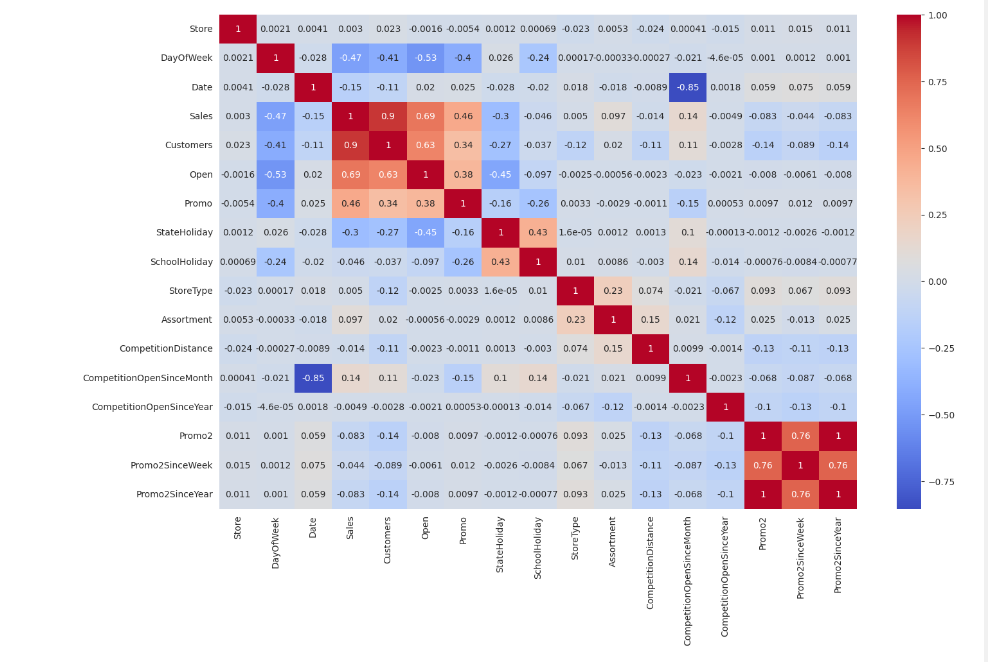

# Store-Sales-Prediction using Machine Learning in Python

---

## Project Overview
This project aims to predict sales for various stores using machine learning and Python. We'll leverage historical sales data and store attributes to identify factors influencing future sales performance. Predictive analytics will be employed to uncover these relationships and build effective models.

## Data Sources
The data for this project originates from Unschool, accessed during my basic data science coursework. The dataset is included within this repository 👉 [store.csv](https://github.com/Thadkapally-Saikiran/Store-Sales-Prediction/blob/main/store.csv),  [test_v2.csv](https://github.com/Thadkapally-Saikiran/Store-Sales-Prediction/blob/main/test_v2.csv), [train_v2.csv](https://github.com/Thadkapally-Saikiran/Store-Sales-Prediction/blob/main/train_v2.csv)

## Problem statement
1. Predict future sales:
   *  The project aims to develop a machine learning model that predicts the sales of different stores based on historical data and various attributes provided in the dataset.
2. Identify key factors:
   * By analyzing the data, the project seeks to discover and understand the factors that significantly influence the number of sales in retail stores. These factors can include customer count, day of the week, promotions, and other relevant attributes.
3. Compare machine learning techniques:
   * The project will implement and compare the performance of normal linear regression techniques with boosting algorithms. The goal is to identify the method that provides the most accurate and reliable sales predictions for the given dataset.
4. Data limitations:
   * The provided data might have limitations, such as the absence of sales data for closed stores or holidays like Easter. These limitations can potentially impact the model's ability to predict sales accurately for scenarios outside the training data.

## Skills/ Concepts demonstrated

The skills or concepts were incorporated in the project:
1. Project Management
   - Problem Statement Definition
   - Experimentation and Analysis
   - Reporting and Visualization
2. Data Analysis Techniques
   - Data Exploration and Cleaning
   - Feature Engineering
   - Data Visualization
3. Machine Learning Techniques
   - Linear Regression
   - Decision tree
   - Random Forest
   - Boosting Algorithms (e.g., XGBoost)
4. Model Building and Evaluation
   - Model Training and Evaluation using Metrics (e.g., MSE, R-squared)

## Visualization:

Correlation Heatmap   
---

Pair-Plot
---

## Goals:
* Implement various machine learning models, including linear regression and boosting algorithms, to predict store sales.
* Compare the performance of different models and identify the one that offers the best results for our specific dataset.
* Utilize data exploration and visualization techniques to understand the relationships between various factors and sales.
* Gain valuable insights into the drivers of store sales within the given dataset.

## Methodology:
* Data Preprocessing: Explore and clean the provided datasets ("train_v2.csv", "test_v2.csv", "store.csv"). This includes handling missing values, outliers, and potentially removing irrelevant data points like closed stores with no sales.
* Data Analysis: Utilize visualization techniques to identify potential correlations between features like customer count, day of week, promotions, and holidays with store sales.
* Model Building: Implement and train various machine learning models, including linear regression, XGBoost, and other boosting algorithms, to predict future sales based on available features.
* Model Evaluation: Compare the performance of different models using metrics like Mean Squared Error (MSE) or R-squared to identify the most effective one for our dataset.
* Visualization and Reporting: Present the findings through visualizations and reports, highlighting key insights about the drivers of store sales and the performance of different models.

## Project Files:
* store-sales-prediction.ipynb: Jupyter notebook containing the entire Python code for data analysis, model building, and evaluation.
* train_v2.csv: Training data for store sales prediction.
* test_v2.csv: Testing data for evaluating the model's performance.
* store.csv: Additional information about the stores involved.
* Data Science-Mini Project.pdf: Project documentation and report further explaining the methodology and results.
  
  
